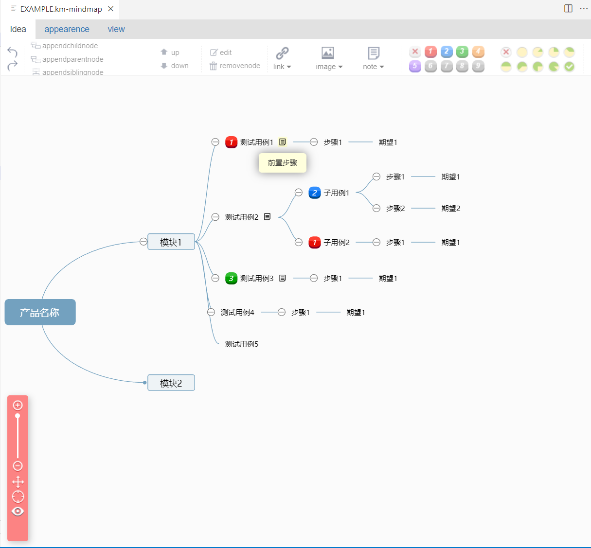

# Install

`pip install km2testcase`

# Usage

`km2testcase --help`

```
Usage: km2testcase [OPTIONS] MARKDOWN_FILE_PATH

Options:
  --output TEXT      Output path of converted csv file.
  --details BOOLEAN  Print details when converting model
  --help             Show this message and exit.
```

## Hello world

Using [EXAMPLE.km](EXAMPLE.km)



```
$ km2testcase EXAMPLE.km --details true

Parsing km file EXAMPLE.km
Collect case: project_name='产品名称' model_name='模块1' case_name='测试用例1' priority=1 prepare='前置步骤' steps=[Step(step='步骤1', expect='期望1')]
Found subcase: 测试用例2-子用例1
Collect case: project_name='产品名称' model_name='模块1' case_name='测试用例2-子用例1' priority=2 prepare='前置步骤\n-----------------------------\n子用例前置条件1' steps=[Step(step='步骤1', e
xpect='期望1'), Step(step='步骤2', expect='期望2')]
Found subcase: 测试用例2-子用例2
Collect case: project_name='产品名称' model_name='模块1' case_name='测试用例2-子用例2' priority=1 prepare='前置步骤' steps=[Step(step='步骤1', expect='期望1')]
Collect case: project_name='产品名称' model_name='模块1' case_name='测试用例3' priority=3 prepare='前置步骤' steps=[Step(step='步骤1', expect='期望1')]
Collect case: project_name='产品名称' model_name='模块1' case_name='测试用例4' priority=2 prepare=None steps=[Step(step='步骤1', expect='期望1')]
Collect case: project_name='产品名称' model_name='模块1' case_name='测试用例5' priority=2 prepare=None steps=[Step(step='步骤1', expect='期望1')]
6 testcases parsed.
Converted project_name='产品名称' model_name='模块1' case_name='测试用例1' priority=1 prepare='前置步骤' steps=[Step(step='步骤1', expect='期望1')] -> model_name='模块1' case_name='测试用例1'
priority='高' prepare='前置步骤' step='1. 步骤1' expect='1. 期望1' case_type='功能测试' stage='功能测试阶段'
Converted project_name='产品名称' model_name='模块1' case_name='测试用例2-子用例1' priority=2 prepare='前置步骤\n-----------------------------\n子用例前置条件1' steps=[Step(step='步骤1', expec
t='期望1'), Step(step='步骤2', expect='期望2')] -> model_name='模块1' case_name='测试用例2-子用例1' priority='中' prepare='前置步骤\n-----------------------------\n子用例前置条件1' step='1. 步
骤1\n2. 步骤2' expect='1. 期望1\n2. 期望2' case_type='功能测试' stage='功能测试阶段'
Converted project_name='产品名称' model_name='模块1' case_name='测试用例2-子用例2' priority=1 prepare='前置步骤' steps=[Step(step='步骤1', expect='期望1')] -> model_name='模块1' case_name='测
试用例2-子用例2' priority='高' prepare='前置步骤' step='1. 步骤1' expect='1. 期望1' case_type='功能测试' stage='功能测试阶段'
Converted project_name='产品名称' model_name='模块1' case_name='测试用例3' priority=3 prepare='前置步骤' steps=[Step(step='步骤1', expect='期望1')] -> model_name='模块1' case_name='测试用例3'
priority='低' prepare='前置步骤' step='1. 步骤1' expect='1. 期望1' case_type='功能测试' stage='功能测试阶段'
Converted project_name='产品名称' model_name='模块1' case_name='测试用例4' priority=2 prepare=None steps=[Step(step='步骤1', expect='期望1')] -> model_name='模块1' case_name='测试用例4' priori
ty='中' prepare='' step='1. 步骤1' expect='1. 期望1' case_type='功能测试' stage='功能测试阶段'
Converted project_name='产品名称' model_name='模块1' case_name='测试用例5' priority=2 prepare=None steps=[Step(step='步骤1', expect='期望1')] -> model_name='模块1' case_name='测试用例5' priori
ty='中' prepare='' step='1. 步骤1' expect='1. 期望1' case_type='功能测试' stage='功能测试阶段'
Writing testcases to EXAMPLE.csv
All testcases written
```

## Advance config

### Zentao

Given that kity minder does not provide more labels, the type and stage of the use case use environment
variables `ZENTAO_CASE_TYPE` and `ZENTAO_STAGE`

# Develop

Install pre-commit before commit

```
pip install pre-commit
pre-commit install
```

Install package locally

```
pip install -e .[test]
```

Run unit-test before PR, **ensure that new features are covered by unit tests**

```
pytest -v
```

# Practice

Using [vscode-mindmap extension](https://marketplace.visualstudio.com/items?itemName=Souche.vscode-mindmap) on vscode

or Using [DesktopNaotu](https://github.com/NaoTu/DesktopNaotu) locally

or Using Web: https://naotu.baidu.com/

# Why Kity Minder(Why not XMind)

- XMind is commercial software, [Kity Minder](https://github.com/fex-team/kityminder) is open-resource
- XMind's performance is poor when there are many cases
- Difficulty in versioning binary files using XMind

# Thanks

Inspired by:

- [xmind2testcase](https://github.com/zhuifengshen/xmind2testcase)

Based on:

- [Kity Minder](https://github.com/fex-team/kityminder)
